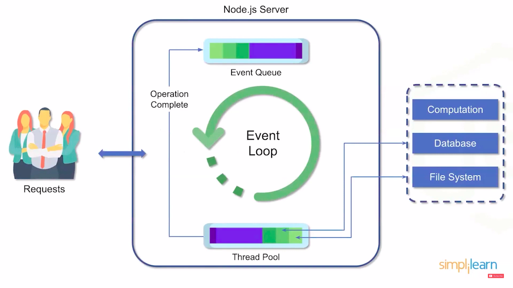
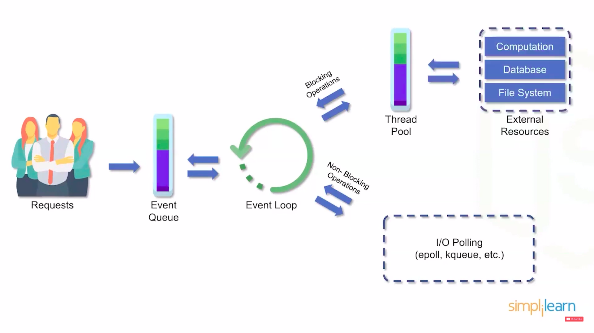

# MERN_Stack-repo

# NODE-JS Architecture

**1.Node-js uses "Single threaded Event Loop" architecture to handle multiple concurrent clients.**

**2.Node.js processing model is based on the javascript event model with javascript call-back mechanisms**

## Lets have a look on a parts in architecture:

### 1.Requests:
### * Clients send requests to web-server
### * Requests can be:
####                1. query for data
####                2. deleting data
####                3. updating data

## # Node-js is a server side platform that takes requests from users, process those requests and returns responses to the corresponding users.

### 2.Event Queue: 
#### -- Node.js receives requests and places them into the event Queue.

### 3.Thread Pool: 
#### -- Nodejs internally maintains a thread pool.

### 4.Event loop: 
#### -- Event loop indefinitely receives requests and process them.

## # External components such as database, file-system, computation.

****************************************************

# what is npm ?
### --> NPM stands for node package manager.

### --> NPM is responsible for managing all the packages and modules for Node.js
--------------------------------------------------
# Node Installation guide

**Download Node.js from https://nodejs.org/en/download/**

**Verify if node.js is properly installed using command prompt or any terminal**
---
#### node --version or node -v

**NPM gets installed alongside, verify if it is properly installed using command prompt or terminal**
---
#### npm --version or npm -v